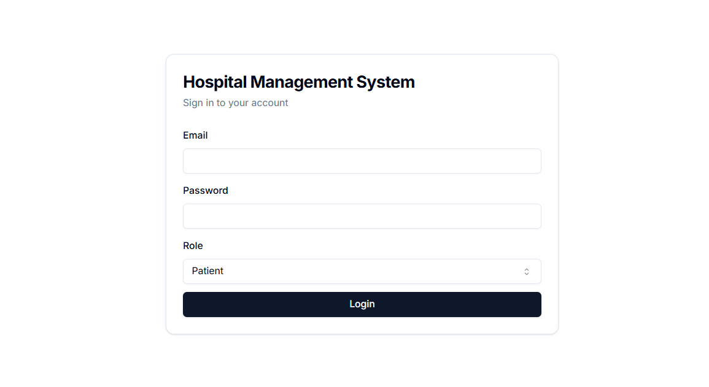

# Healthcare Management System

## Overview

The Healthcare Management System is designed to manage patient and doctor information, appointments, prescriptions, and more. It provides a comprehensive backend structure to handle various functionalities required in a healthcare environment.

## Backend Structure

The backend is built using Node.js and Express.js. It includes the following main components:

### Routes

- **Patients**: Handles patient-related operations such as fetching patient data, booking appointments, and accessing the patient dashboard.
- **Doctors**: Manages doctor-related operations including fetching doctor details, managing appointments, and prescribing medications.
- **Eclinic**: Provides functionalities for the eclinic section, including showing available diseases and recommending actions based on survey responses.

### Middleware

- **verify_patient**: Middleware to verify patient authentication using JWT.
- **verify_doctor**: Middleware to verify doctor authentication using JWT.

### Database

- **db.js**: Contains functions to interact with the PostgreSQL database, including fetching and inserting data for patients, doctors, appointments, and more.

### Authentication

- **authRouter**: Manages user authentication, including login and registration for both patients and doctors.

## How It Works

1. **Authentication**: Users (patients and doctors) can register and log in. JWT tokens are used for authentication.
2. **Patient Operations**: Patients can view their data, book appointments, and access their dashboard to see upcoming and past appointments, prescriptions, and tests.
3. **Doctor Operations**: Doctors can view their details, manage appointments, view patient details, prescribe medications, and recommend tests.
4. **Eclinic**: Users can access the eclinic section to view available diseases, take surveys, and get recommendations based on their responses.

## Frontend Structure

The frontend is built using Next.js and React. It includes the following main components:

### Pages

- **Login**: Allows users to log in to their accounts.
- **Doctor Dashboard**: Displays doctor-specific information, including appointments and patient details.
- **Patient Dashboard**: Displays patient-specific information, including upcoming appointments and medical history.

- **data-fetch**: Contains functions to interact with the backend API, including login, fetching doctor details, and managing appointments.

## How It Works

1. **Authentication**: Users log in through the login page. Upon successful login, they are redirected to their respective dashboards.
2. **Doctor Dashboard**: Doctors can view their appointments, patient details, and prescribe medications or tests.
3. **Patient Dashboard**: Patients can view their upcoming appointments, medical history, and test results.

## API Documentation

For full API documentation, please visit [API Docs](https://cyclic-somersault-de7.notion.site/Out-Patient-HealthCare-API-documentation-ec480f9a56d04f52a2a0b26785f65c41).

## Photos

Here are some screenshots of the Healthcare Management System:

### Login Page


_Description: The login page where users can enter their credentials to access the system._

### Doctor Dashboard


_Description: The dashboard for doctors showing appointments, patient details, and options to prescribe medications._

### Patient Dashboard


_Description: The dashboard for patients displaying upcoming appointments, medical history, and test results._

## Installation

Follow these steps to set up and run the Healthcare Management System:

### Prerequisites

- Node.js (v14 or higher)
- PostgreSQL
- Git

### Backend Setup

1. Clone the repository:

   ```sh
   git clone https://github.com/Keerthan04/Healthcare-Management-System.git
   cd healthcare-management-system
   ```

2. Install backend dependencies:

   ```sh
   cd backend
   npm install
   ```

3. Start the backend server:

   ```sh
   npm start
   ```

### Frontend Setup

1. Navigate to the frontend directory:

   ```sh
   cd ../frontend
   ```

2. Install frontend dependencies:

   ```sh
   npm install
   ```

3. Start the frontend development server:

   ```sh
   npm run dev
   ```

### Running the Application

1. Ensure the backend server is running on the specified port (default: 8080).
2. Ensure the frontend server is running on the specified port (default: 3000).
3. Open your browser and navigate to `http://localhost:3000` to access the application.

You should now be able to use the Healthcare Management System locally.

## Environment Configuration

To obtain the necessary environment configuration files, please contact the administrator by sending an email to `ckeerthankumar4@gmail.com`.
